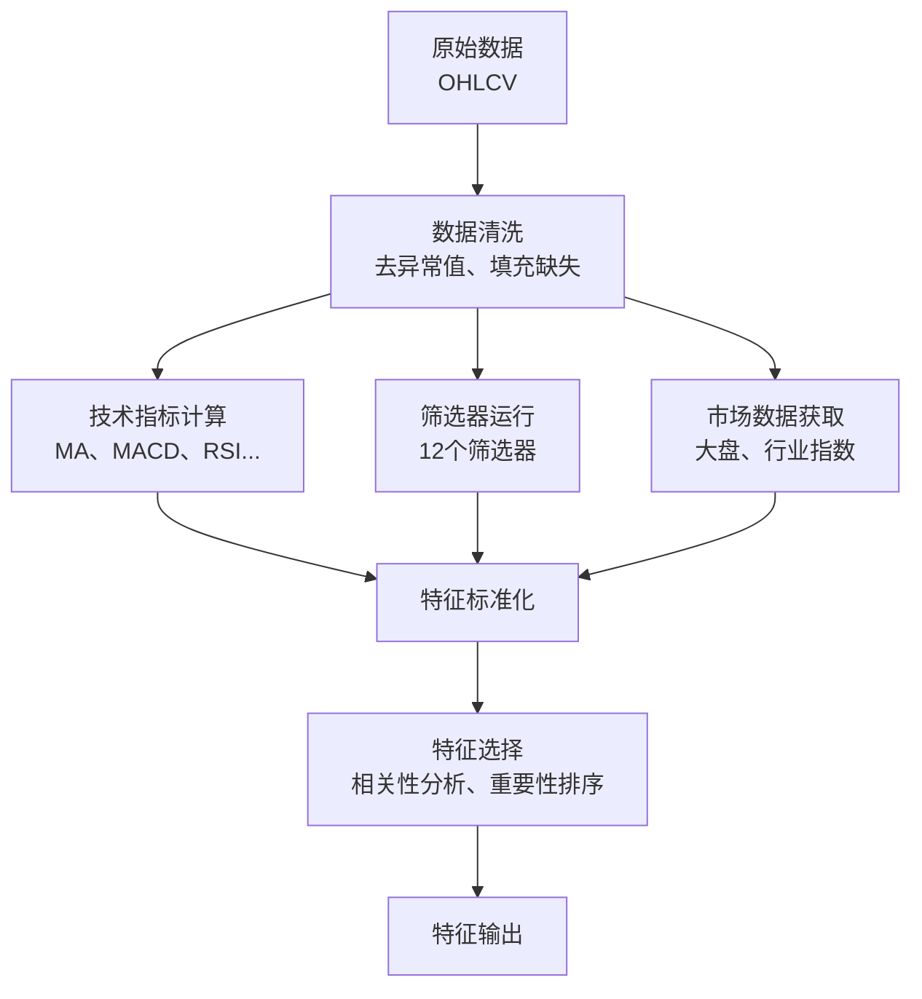

# 特征工程

## 概述

特征工程是机器学习项目的核心环节。本项目从多个维度构建特征，包括技术指标、筛选器特征和市场相对特征。

## 特征分类

```
特征体系
├── 技术指标特征 (Technical Indicators)
│   ├── 趋势指标 (Trend)
│   ├── 动量指标 (Momentum)
│   ├── 波动率指标 (Volatility)
│   └── 成交量指标 (Volume)
├── 筛选器特征 (Screener Features)
│   └── NeoTrade2 筛选器命中结果
└── 市场相对特征 (Relative Performance)
    ├── 相对大盘 (Relative to Market)
    └── 相对行业 (Relative to Industry)
```

## 1. 技术指标特征

### 1.1 趋势指标 (Trend)

#### 移动平均线 (Moving Average)

| 特征 | 窗口 | 计算公式 | 说明 |
|------|------|----------|------|
| `ma5` | 5 | MA5 = close.rolling(5).mean() | 5日均线，短期趋势 |
| `ma10` | 10 | MA10 = close.rolling(10).mean() | 10日均线 |
| `ma20` | 20 | MA20 = close.rolling(20).mean() | 20日均线，月线 |
| `ma60` | 60 | MA60 = close.rolling(60).mean() | 60日均线，季线 |

**衍生特征**:
- 价格在 MA 线上方/下方
- MA 线多头/空头排列
- MA 线斜率

#### 指数移动平均 (EMA)

| 特征 | 窗口 | 计算公式 | 说明 |
|------|------|----------|------|
| `ema12` | 12 | EMA12 = close.ewm(span=12).mean() | 12日指数均线 |
| `ema26` | 26 | EMA26 = close.ewm(span=26).mean() | 26日指数均线 |

**MACD 指标**:

| 特征 | 计算公式 | 说明 |
|------|----------|------|
| `macd` | MACD = EMA12 - EMA26 | DIF 线 |
| `macd_signal` | Signal = MACD.ewm(span=9).mean() | DEA 线 |
| `macd_hist` | Histogram = MACD - Signal | 柱状图 |

**信号**:
- MACD > Signal: 买入信号
- MACD < Signal: 卖出信号
- MACD 穿越零轴: 趋势反转信号

### 1.2 动量指标 (Momentum)

#### RSI (相对强弱指标)

| 特征 | 窗口 | 计算公式 | 范围 |
|------|------|----------|------|
| `rsi` | 14 | RSI = 100 - 100/(1 + RS) | [0, 100] |

其中:
```
RS = Average Gain / Average Loss
Average Gain = avg(positive delta, 14)
Average Loss = avg(abs(negative delta), 14)
```

**信号**:
- RSI > 70: 超买
- RSI < 30: 超卖
- RSI = 50: 多空平衡

#### 历史收益率 (Returns)

| 特征 | 周期 | 计算公式 | 说明 |
|------|------|----------|------|
| `return_3d` | 3日 | return = close / close.shift(3) - 1 | 短期收益 |
| `return_5d` | 5日 | return = close / close.shift(5) - 1 | 短期收益 |
| `return_10d` | 10日 | return = close / close.shift(10) - 1 | 中期收益 |
| `return_20d` | 20日 | return = close / close.shift(20) - 1 | 月度收益 |
| `return_60d` | 60日 | return = close / close.shift(60) - 1 | 季度收益 |

### 1.3 波动率指标 (Volatility)

#### ATR (平均真实波幅)

| 特征 | 窗口 | 计算公式 | 说明 |
|------|------|----------|------|
| `atr` | 14 | ATR = TR.rolling(14).mean() | 平均真实波幅 |

其中:
```
TR = max(high - low, |high - close_prev|, |low - close_prev|)
```

**用途**: 衡量价格波动程度，用于设置止损位。

#### 历史波动率 (Historical Volatility)

| 特征 | 窗口 | 计算公式 | 说明 |
|------|------|----------|------|
| `volatility_10d` | 10日 | std(pct_change, 10) | 短期波动率 |
| `volatility_20d` | 20日 | std(pct_change, 20) | 中期波动率 |
| `volatility_60d` | 60日 | std(pct_change, 60) | 长期波动率 |

#### 布林带 (Bollinger Bands)

| 特征 | 窗口 | 计算公式 | 说明 |
|------|------|----------|------|
| `bollinger_middle` | 20 | MA20 | 中轨 |
| `bollinger_upper` | 20 | MA20 + 2 * std(20) | 上轨 |
| `bollinger_lower` | 20 | MA20 - 2 * std(20) | 下轨 |
| `bollinger_pct` | - | (close - lower) / (upper - lower) | 价格位置 [0,1] |

**信号**:
- `bollinger_pct` > 1: 突破上轨
- `bollinger_pct` < 0: 跌破下轨
- `bollinger_pct` 接近 0.5: 价格在中轨附近

#### KDJ 指标

| 特征 | 窗口 | 计算公式 | 范围 |
|------|------|----------|------|
| `stoch_k` | 14, 3 | K = 100 * (C - L14) / (H14 - L14) | [0, 100] |
| `stoch_d` | 3 | D = K.rolling(3).mean() | [0, 100] |

其中:
```
C = 当日收盘价
L14 = 14日最低价
H14 = 14日最高价
```

**信号**:
- K > D 且 K < 20: 超卖，买入信号
- K < D 且 K > 80: 超买，卖出信号

### 1.4 成交量指标 (Volume)

#### 成交量比率

| 特征 | 计算公式 | 说明 |
|------|----------|------|
| `vol_ratio_5d` | volume / MA(volume, 5) | 5日量比 |
| `vol_ratio_20d` | volume / MA(volume, 20) | 20日量比 |

**信号**:
- `vol_ratio_5d` > 2: 放量
- `vol_ratio_5d` < 0.5: 缩量

#### 基础成交量特征

| 特征 | 单位 | 说明 |
|------|------|------|
| `volume` | 股 | 成交量 |
| `amount` | 元 | 成交额 |
| `turnover` | % | 换手率 |

## 2. 筛选器特征 (Screener Features)

筛选器特征来自 NeoTrade2 项目的 12 个技术分析筛选器。这些筛选器捕捉特定的技术形态和交易信号。

### 筛选器列表

| 筛选器名称 | 类型 | 说明 |
|------------|------|------|
| `coffee_cup_screener` | 形态 | 咖啡杯柄形态 |
| `coffee_cup_handle_screener_v4` | 形态 | 咖啡杯柄 V4 版本 |
| `jin_feng_huang_screener` | 涨停 | 涨停金凤凰 |
| `yin_feng_huang_screener` | 涨停 | 涨停银凤凰 |
| `shi_pan_xian_screener` | 涨停 | 涨停试盘线 |
| `er_ban_hui_tiao_screener` | 形态 | 二板回踩 |
| `zhang_ting_bei_liang_yin_screener` | 涨停 | 涨停倍量阴 |
| `breakout_20day_screener` | 突破 | 20日突破 |
| `breakout_main_screener` | 突破 | 主升突破 |
| `daily_hot_cold_screener` | 资金 | 每日冷热股 |
| `shuang_shou_ban_screener` | 涨停 | 双手板 |
| `ashare_21_screener` | 综合 | A股21综合选股 |

### 特征字段

| 字段 | 类型 | 说明 |
|------|------|------|
| `screener_name` | String | 筛选器名称 |
| `hit` | Boolean | 是否命中该筛选器 |
| `score` | Float | 筛选器评分（如果有） |
| `reason` | String | 命中原因 |
| `extra_data` | JSON | 额外数据（形态参数等） |

### 特征编码

对于机器学习模型，筛选器特征可以编码为：

1. **二元特征**: 每个筛选器一个 0/1 特征
2. **特征聚合**:
   - `screener_count`: 命中的筛选器数量
   - `screener_momentum`: 命中筛选器的趋势类型
   - `screener_pattern`: 命中筛选器的形态类型

## 3. 市场相对特征 (Relative Performance)

市场相对特征衡量股票相对于大盘和行业的表现，捕捉相对强弱。

### 3.1 相对大盘

| 特征 | 计算公式 | 说明 |
|------|----------|------|
| `rel_to_market` | stock_return - market_return | 相对大盘收益 |

**大盘指数**:
- 上证综指: 000001.SH
- 深证成指: 399001.SZ
- 沪深300: 000300.SH

### 3.2 相对行业

| 特征 | 计算公式 | 说明 |
|------|----------|------|
| `rel_to_industry` | stock_return - industry_index_return | 相对行业收益 |

**行业分类**:
- 申万一级行业 (28个)
- 按股票的 `industry` 字段分类

### 3.3 相对强度指标

| 特征 | 计算公式 | 说明 |
|------|----------|------|
| `rs_relative` | stock_return / market_return | 相对强度比率 |
| `beta` | cov(stock, market) / var(market) | Beta 系数 |

## 特征统计

### 特征数量统计

| 类别 | 特征数量 |
|------|----------|
| 趋势指标 | 11 |
| 动量指标 | 8 |
| 波动率指标 | 8 |
| 成交量指标 | 5 |
| 筛选器特征 | 12+ |
| 市场相对特征 | 4+ |
| **总计** | **50+** |

### 特征分布

```
技术指标特征    ████████████████████░░░░░  约 35 个
筛选器特征      ████░░░░░░░░░░░░░░░░░░░  约 12 个
市场相对特征    ███░░░░░░░░░░░░░░░░░░░░   约 4 个
```

## 特征工程流程



## 特征选择策略

### 1. 相关性过滤

```python
# 去除高相关性特征
corr_matrix = features.corr()
high_corr_pairs = []
for i in range(len(corr_matrix.columns)):
    for j in range(i+1, len(corr_matrix.columns)):
        if abs(corr_matrix.iloc[i, j]) > 0.9:
            high_corr_pairs.append((i, j))
```

### 2. 特征重要性排序

```python
# 使用模型特征重要性
import xgboost as xgb
model = xgb.XGBClassifier()
model.fit(X_train, y_train)
importance = model.feature_importances_
```

### 3. 递归特征消除 (RFE)

```python
from sklearn.feature_selection import RFE
rfe = RFE(estimator=model, n_features_to_select=30)
rfe.fit(X_train, y_train)
selected_features = X_train.columns[rfe.support_]
```

## 特征工程最佳实践

1. **避免数据泄漏**: 特征计算只能使用预测时刻之前的数据
2. **处理缺失值**: 对于技术指标，使用前向填充或删除
3. **特征标准化**: 使用 RobustScaler 处理异常值
4. **特征监控**: 定期检查特征分布的变化

## 特征版本管理

```python
# features_version.json
{
    "version": "1.0",
    "created_at": "2026-04-14",
    "features": [...],
    "feature_groups": {
        "trend": ["ma5", "ma10", ...],
        "momentum": ["rsi", "return_5d", ...],
        ...
    }
}
```
